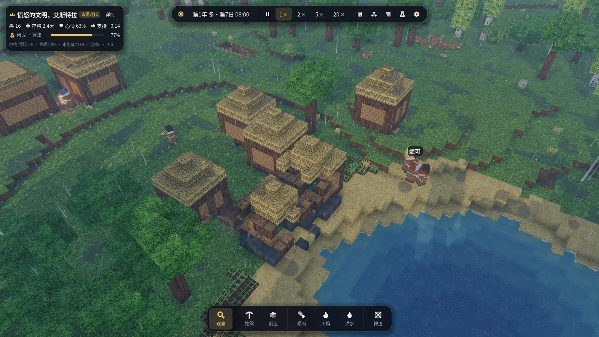

# 第二版本开发计划（A + C）

本版本合并两份草案：

- **A · 世界与文明的尺度**：生命周期与世代、扩张与聚落、开局即多国、规模与性能。
- **C · 魔法少女的戏剧**：可见的魔法、关系网与派系、源动力转变、可见的议会辩论、英雄式战斗、更深的外交（同盟、附庸、朝贡、停战）。

B（教程、剧本、音效、时间线回放）不在本版本。

同时吸收对第一版本的反馈：开局科技过高、没有野生动物、野外资源种类少、生态群系单一、
水与雨的观感不足、建筑与物品缺乏生活感、没有装备系统。

## 验收场景

### 场景一 · 三国空岛（`--scenario three_realms`）

- 一座远大于第一版本的空岛（主岛半径约 3 倍，面积约 9 倍），岛上有多种生态群系。
- 三个文明各据一方（不同群系），开局彼此敌对，各自有魔法少女与居民。
- 大多数时候各国优先自身发展（采集、建设、研究、扩张聚落）。
- 在判断合适时（实力对比、边境摩擦、资源争夺、仇怨）会宣战，军队行军、列阵、激烈交战，
  魔法少女在战场上施展可见的法术。
- 战争会以谈和结束：停战、割地、朝贡或附庸；两国也可能结盟对付第三国。
- 验收方式：`icarus_cli run --scenario three_realms` 多种子批量实验，统计「发展—战争—谈和」
  出现的比例，并在 Godot 中截图观察。

### 场景二 · 蛮荒开局（`--scenario wild`，或新游戏的「开局时代：蛮荒」）

- 开局没有任何建筑、仓库与存粮；居民睡在地上，靠摘果子、采蘑菇、打猎生存，
  穿树叶编的衣服。
- 有办法活下去：野果、野生谷物、可猎的动物、泉水与溪流；篝火取暖和烤肉。
- 科技与村落建设真正成为游戏进程：用火 → 打制石器 → 狩猎 → 制皮（兽皮衣）→ 窝棚 →
  茅草屋 → 农耕 → 储藏 → 木工/制陶 … 每一步都由魔法少女的决策推动，并在地图上看得见。
- 验收方式：CLI 批量运行 30 天，统计存活率、首次建造窝棚/茅屋/农田的时间与科技进度。

第一版本的「村、田、桥、水」开局保留为「开局时代：村落」，经典小岛布局保留为
`--layout classic`，旧存档与旧实验继续可用。

## 里程碑

每个里程碑拆成若干可独立验证的小步：实现 → 无头测试 → 真实渲染检查 → 提交推送。全部里程碑已完成，验收结果见文末「验收结果」。

### M10 · 世界 v2：大岛、多群系、更多野外资源 ✅
- `WorldConfig.layout`：`Classic`（第一版本小岛）与 `Continent`（大岛，半径约 330，
  不规则海岸线、山脉、湖泊、河流、峡谷、周边小岛）。
- 群系由温度 / 湿度 / 海拔噪声决定：草原、阔叶林、针叶林、雪原高地、荒漠（红沙/砂岩）、
  沼泽湿地、湖滨沙滩、岩山。
- 新方块：雪、冰、泥、红沙、砂岩、花岗岩、石灰岩、燧石结核、泥炭；针叶树、白桦、果树
  （结果子）、仙人掌、芦苇、野生谷物、蘑菇、野生草药。
- 新物品：燧石、果子、蘑菇、生肉、熟肉、兽皮、骨头、芦苇等。
- 三个文明的出生点（不同群系、相距较远），蛮荒开局的营地选址。
- 渲染：新方块的程序材质，大世界的网格化预算、可见距离与远景 LOD。

### M11 · 装备系统 ✅
- 工具按种类区分：斧（伐木）、镐（采石采矿）、锄（开垦耕地）、锤（建造、制作）、
  镰（收割）、刀（屠宰、制皮）；武器：木矛、石矛、弓、剑；材质分燧石/石、铜、铁三档。
- 居民装备栏：工具、武器、护甲、衣服；工作前按需去仓库换取合适的工具，归还旧工具；
  工具有耐久，用坏会磨损消失。
- 工具实际影响工作：效率倍率、没有合适工具时的惩罚（徒手挖石极慢），部分工作需要工具。
- 渲染：手上显示真实装备的模型，工作动作随工具不同（斧横劈、镐上举下砸、锄下刨、锤连击、
  镰低扫、刀切割），衣服外观随服装不同（叶衣、兽皮衣、布衣）。
- UI：人物卡显示装备栏与耐久。

### M12 · 野生动物 ✅
- 内核 `Fauna`：确定性、可存档的动物实体（兔、鹿、野猪、山羊、狼、熊、鱼、鸟），按群系分布。
- 行为：游荡、觅食、结群、受惊逃跑、捕食者狩猎、繁殖与种群上限、老死与被猎杀。
- 狩猎：猎人持武器追猎；尸体可屠宰得到生肉、兽皮、骨头；野兽也可能袭击落单居民。
- 远离角色的动物低频模拟（LOD），休眠地格中的种群用统计方式推进。
- 渲染：体素风格的动物模型与步态动画。

### M13 · 蛮荒开局与「开局时代」 ✅
- 新游戏可选开局时代：蛮荒 / 部落 / 村落；地图可选经典小岛 / 大岛；文明数 1–3。
- 蛮荒阶段：篝火营地（地上的物品堆作为存放处）、露天睡觉、采集与狩猎为主、叶衣与兽皮衣。
- 科技树前段重做：用火、打制石器、狩猎、制皮、编织、窝棚、茅草屋、农耕、储藏……
  没有建筑时也能研究（围着篝火琢磨），决策由魔法少女做出。
- 新建筑：篝火、窝棚、晾肉架、皮革架等蛮荒建筑，逐步过渡到茅屋、仓库、工坊。

### M14 · 生命周期与世代 ✅
- 出生：伴侣关系、住房与粮食充足时会有孩子；孩子长大（儿童不工作、需要照料）、成年、衰老、
  老死；人口随发展增长，也随饥荒、战争下降。
- 家庭与住房需求：人口增长推动建房与扩张。
- 魔法少女的继任：旧的魔法少女老去 / 牺牲后，新的魔法少女觉醒（源动力受经历影响）。

### M15 · 三国：聚落扩张、战略与外交 ✅
- 开局三国，各有领土（地格归属）；扩张：在远处资源点建立新聚落，修路架桥，占领小岛。
- 国家战略层：发展优先，按实力对比、边境摩擦、资源短缺、仇怨与盟友判断是否宣战。
- 激烈交战：集结、行军、战线、冲锋与撤退、攻城（破坏建筑方块）、魔法少女的战场法术。
- 外交：停战（带期限）、割地、朝贡、附庸、同盟（共同对敌）、背盟；条款由统治者决策与谈判。

### M16 · 魔法少女的戏剧 ✅
- 可见的法术：每个法术有独立的粒子/光效与施法动作。
- 关系网：魔法少女之间的好感、竞争、师徒、宿敌；国内派系（支持者集团）。
- 源动力转变：重大经历（战败、挚友牺牲、饥荒）可能让源动力发生转变。
- 可见的议会辩论：议题、各方发言（气泡/辩论卡）、投票与结果。
- 英雄式战斗：魔法少女对决、以一敌多，但无法取代军队与生产。
- 传记：每位魔法少女的人生大事记。

### M17 · 画面：水、雨与生活感 ✅
- 水：深度着色、岸边泡沫、流向、瀑布、雨点涟漪；雨：雨丝、溅射、地面湿润与积水。
- 建筑内部：床铺、桌椅、火塘、货架、工作台、铁砧；屋外：晾衣绳、柴堆、水缸。
- 物品按类型呈现：原木堆、石料堆、谷物麻袋、果篮、陶罐、工具架、兽皮、肉架。

### M18 · 性能与验收 ✅
- 目标：约 150 名居民 + 数百动物，平均每 tick 开销可控，消除单 tick 150ms 级别的尖峰
  （分层寻路 / 路径缓存 / 分帧决策）。
- 两个验收场景的批量实验与截图，更新 ARCHITECTURE 与 README。

## 验收结果

两个验收场景各在大岛上运行 32 个游戏日（一整年），三国 8 个种子、蛮荒 6 个种子。复现：

```bash
tools/acceptance.sh out/acceptance 3     # 运行全部 14 局并输出下面两张表（约 20 分钟，3 路并行）
```

表中「天」从开局算起（一年 32 天：春夏秋冬各 8 天）。

### 场景一 · 三国空岛

| 种子 | 首次宣战（天） | 宣战 | 会战 | 溃退 | 议和/停战 | 称臣 | 征服 | 阵亡 | 对决 | 随军出征 | 施法 | 源动力转变 | 觉醒 | 饿死 | 人口 始→终 | 终局国家数 |
|---|---|---|---|---|---|---|---|---|---|---|---|---|---|---|---|---|
| 1 | 14.9 | 1 | 1 | 0 | 0 | 2 | 0 | 4 | 5 | 4 | 25 | 0 | 6 | 0 | 64→65 | 4 |
| 2 | 18.8 | 2 | 1 | 0 | 0 | 0 | 0 | 7 | 5 | 4 | 43 | 0 | 3 | 0 | 66→60 | 2 |
| 3 | — | 0 | 0 | 0 | 0 | 0 | 0 | 0 | 0 | 0 | 0 | 0 | 1 | 0 | 64→67 | 4 |
| 4 | 31.4 | 1 | 0 | 0 | 0 | 0 | 0 | 0 | 0 | 3 | 12 | 1 | 2 | 0 | 67→79 | 5 |
| 5 | 12.0 | 1 | 1 | 0 | 0 | 0 | 1 | 9 | 3 | 3 | 3 | 0 | 1 | 0 | 64→63 | 2 |
| 6 | 24.0 | 1 | 1 | 0 | 0 | 0 | 1 | 4 | 3 | 5 | 16 | 1 | 3 | 0 | 65→67 | 3 |
| 7 | 11.9 | 2 | 3 | 2 | 2 | 0 | 0 | 14 | 3 | 9 | 28 | 0 | 4 | 0 | 67→65 | 4 |
| 8 | 27.1 | 1 | 2 | 0 | 0 | 0 | 0 | 3 | 9 | 4 | 35 | 2 | 3 | 0 | 64→77 | 3 |

- **先发展，后开战**：宣战最早在第 11.9 天（好战的「愤怒」统治者），多数在第 15–31 天；
  统治者的源动力决定她埋头发展的时长（10–19 天，每国另有 0–4 天的差异），此后仍须有理由
  （积怨、对方的饥荒或内乱、兵力优势、己方缺粮而对方富足）、足够的武器与兵力才会开战。
  种子 3 整年未起战事。
- **激烈交战**：军队行军、列阵交战、溃退与围城；魔法少女随军出征、彼此对决、在战场上施法。
  每局阵亡 3–14 人。
- **战争的结局**：议和停战（种子 7 两次）、城下之盟称臣纳贡（种子 1）、征服吞并（种子 5、6），
  其余到年末仍在交战或对峙；另有通商、援粮、结盟提议与背盟。上一轮同版本批量中 8 局有 4 局议和。
- **没有饥荒**：8 局无一人饿死；人口大体持平或增长（战争与分裂使部分国家减员，也有新的
  魔法少女觉醒、分裂出新的政权）。

### 场景二 · 蛮荒开局

| 种子 | 石器 | 狩猎 | 窝棚（科技） | 农耕 | 第一片田 | 茅草屋（科技） | 储藏 | 农耕时代 | 青铜时代 | 铁器时代 | 饿死 | 人口 始→终 | 终局国家数 | 床位 | 建成 |
|---|---|---|---|---|---|---|---|---|---|---|---|---|---|---|---|
| 1 | 6.4 | 1.5 | 7.7 | 7.4 | 10.2 | 9.6 | 14.4 | 5.6 | 28.5 | — | 0 | 17→21 | 1 | 6 | 仓库×1、茅屋×2 |
| 2 | 4.4 | 1.4 | 8.5 | 7.5 | 8.2 | 10.3 | 10.5 | 4.7 | — | — | 0 | 17→22 | 1 | 11 | 窝棚×1、茅屋×1、长屋×1 |
| 3 | 1.5 | 1.4 | 4.3 | 2.7 | — | 4.5 | 10.7 | 2.7 | 8.8 | 20.6 | 0 | 17→22 | 2 | 3 | 仓库×1、工坊×1、灶房×1、瞭望塔×1、茅屋×1 |
| 4 | 3.5 | 1.3 | 8.4 | 4.7 | 6.1 | 9.4 | 12.4 | 3.4 | 11.7 | 31.4 | 0 | 17→16 | 1 | 18 | 仓库×1、茅屋×4、长屋×1 |
| 5 | 4.4 | 1.4 | 17.6 | 6.5 | 10.2 | 24.6 | 17.5 | 4.4 | 16.6 | — | 0 | 17→17 | 2 | 0 | — |
| 6 | 4.6 | 1.3 | 6.5 | 7.4 | 10.2 | 8.3 | 8.3 | 3.6 | 29.3 | — | 0 | 17→21 | 1 | 5 | 窝棚×1、茅屋×1 |

- **活得下去**：6 局无一人饿死，人口 17 人增长到 16–22 人（部分分裂为两个政权）。
- **科技是真实的进程**：狩猎第 1–2 天，打制石器第 1.5–6.4 天，农耕第 2.7–7.5 天，第一片田第
  6–10 天（种子 3 一直靠采集与狩猎），茅草屋、储藏随后；新时代的科技须先掌握上一时代一半的
  科技，大多在年内迈入青铜时代，两局进入铁器时代。
- **村落真正建起来**：6 局中 5 局在年内从露宿篝火边变成有屋可住的村落（3–18 个床位；茅屋、
  窝棚、长屋、仓库、工坊、灶房、瞭望塔），种子 5 年末仍只有篝火。



### 性能

三国局的平均 tick 约 0.64 ms（3 局并行、4 核）。区域测绘改为分帧进行（每 tick 最多 4000 个
位置，存档中途也能精确续跑），消除了每天一次约 80 ms 的卡顿；偶发的长寻路尖峰约 40–60 ms。

### 验收中发现并修复的问题

批量实验暴露出若干埋得很深的问题，修复后才得到上面的结果：

- 伐木、采石的巡查因为时间错位**从不执行**：没有人去砍树，蛮荒部落永远盖不起房子。
- 轻的物品（草秆）运进工地时容量换算**整数溢出**，茅草永远送不到工地。
- 屋顶高出地面 3 格以上就**够不着**：比窝棚高的建筑一座也完不成（现在工匠可以踩梯子够到 7 格高）。
- 统治者**同时开工十几座茅屋**，材料被摊薄到哪座也完不成；造不出材料的建筑（缺石块的粮仓）
  占着木板茅草不放。现在工地多于 3 处时不再开新工，材料优先送给最接近完工的工地。
- 湖边的茅屋**建在浅水里**。
- 做工失败会把仓库本身列为「去不了的地方」，此后采来的东西都被扔在路上；大岛上被截断的
  区域测绘也会把可达的仓库当成不可达。
- 谷种不够时居民不吃谷子，但仍被「有粮」的仓库吸引，**来回白跑**而饿死在野果丛旁。
- 人人都去干最要紧的粮食活，建筑与伐木**永远没人做**；反过来粮仓见底时也没有人自动转回觅食。
  现在建筑与采集保有约 15% 的人手（只在大家吃得饱时），粮食将尽时粮食活自动变得更急。
- 一块田只养得活不到半个人，统治者却按「一人一块」规划；缺田时照样生育，还在饥荒中把最后的
  口粮种下去。
- 所有文明都在立国满 10 天的那一刻开战；蛮荒部落 10 天就从制陶跳到律法（铁器时代）。

### 仍可改进

- 在一年之内，议和比征服与称臣少见；很多战争到年末仍未了结。
- 蛮荒部落要到农耕时代才建起第一座屋子；个别种子（5）整年只有篝火。

## 兼容性

- 存档格式继续以尾随区块扩展，旧存档可读。
- 第一版本的测试、实验与经典开局保持可用，新的内容以新的布局 / 开局时代出现。
