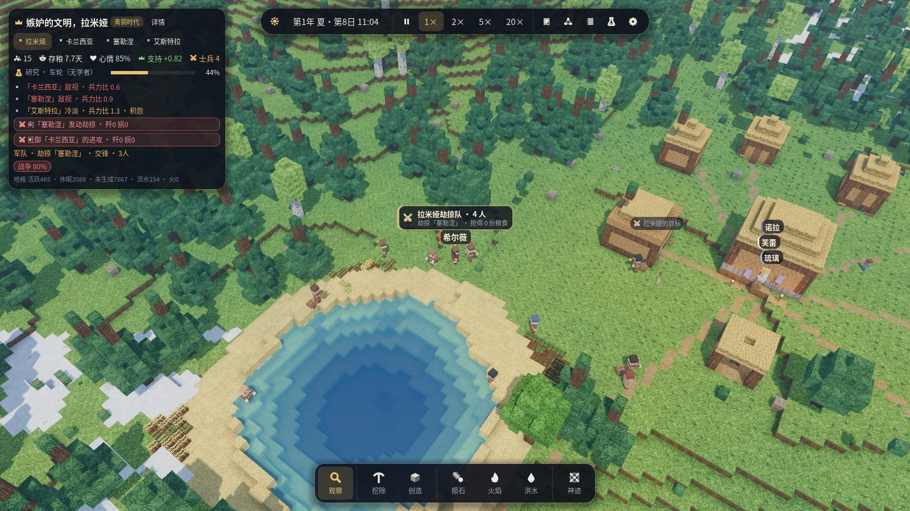
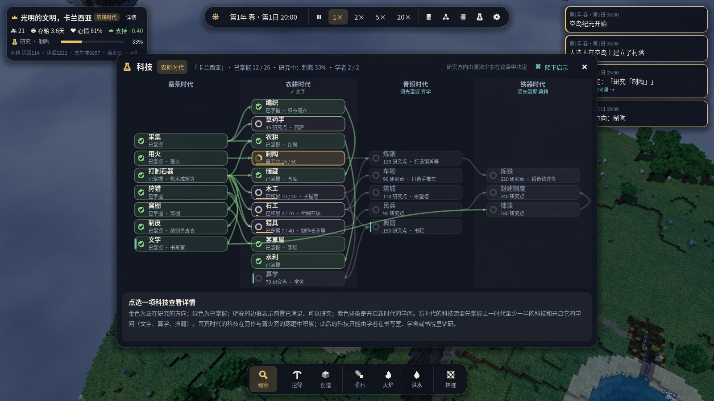
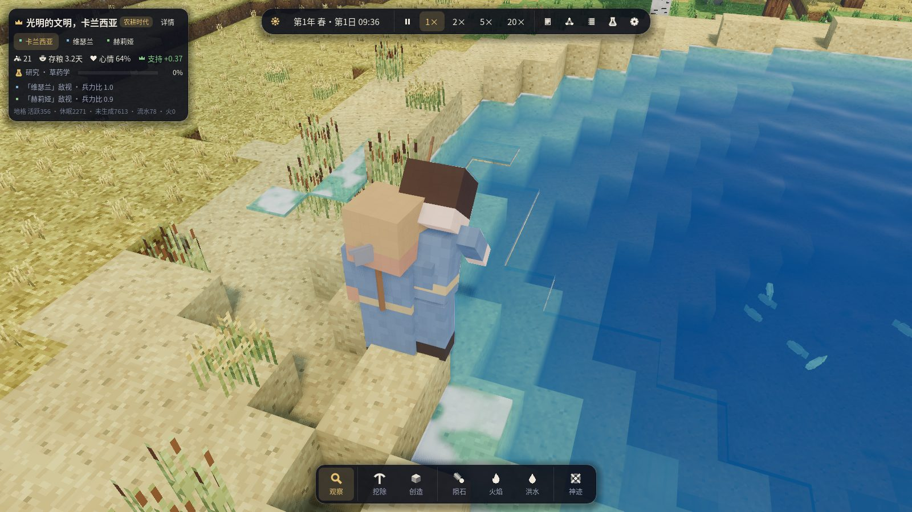
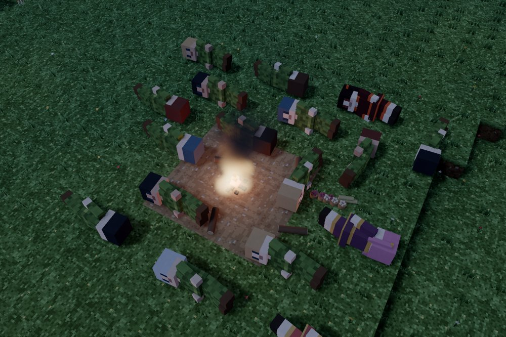

# 第二版本开发计划（A + C）

本版本合并两份草案：

- **A · 世界与文明的尺度**：生命周期与世代、扩张与聚落、开局即多国、规模与性能。
- **C · 魔法少女的戏剧**：可见的魔法、关系网与派系、源动力转变、可见的议会辩论、英雄式战斗、更深的外交（同盟、附庸、朝贡、停战）。

B（教程、剧本、音效、时间线回放）不在本版本。

同时吸收对第一版本的反馈：开局科技过高、没有野生动物、野外资源种类少、生态群系单一、
水与雨的观感不足、建筑与物品缺乏生活感、没有装备系统。

## 验收场景

### 场景一 · 三国空岛（`--scenario three_realms`）

- 一座远大于第一版本的空岛（主岛半径约 3 倍，面积约 9 倍），岛上有多种生态群系。
- 三个文明各据一方（不同群系），开局彼此敌对，各自有魔法少女与居民。
- 大多数时候各国优先自身发展（采集、建设、研究、扩张聚落）。
- 在判断合适时（实力对比、边境摩擦、资源争夺、仇怨）会宣战，军队行军、列阵、激烈交战，
  魔法少女在战场上施展可见的法术。
- 战争会以谈和结束：停战、割地、朝贡或附庸；两国也可能结盟对付第三国。
- 验收方式：`icarus_cli run --scenario three_realms` 多种子批量实验，统计「发展—战争—谈和」
  出现的比例，并在 Godot 中截图观察。

### 场景二 · 蛮荒开局（`--scenario wild`，或新游戏的「开局时代：蛮荒」）

- 开局没有任何建筑、仓库与存粮；居民睡在地上，靠摘果子、采蘑菇、打猎生存，
  穿树叶编的衣服。
- 有办法活下去：野果、野生谷物、可猎的动物、泉水与溪流；篝火取暖和烤肉。
- 科技与村落建设真正成为游戏进程：用火 → 打制石器 → 狩猎 → 制皮（兽皮衣）→ 窝棚 →
  茅草屋 → 农耕 → 储藏 → 木工/制陶 … 每一步都由魔法少女的决策推动，并在地图上看得见。
- 验收方式：CLI 批量运行 30 天，统计存活率、首次建造窝棚/茅屋/农田的时间与科技进度。

第一版本的「村、田、桥、水」开局保留为「开局时代：村落」，经典小岛布局保留为
`--layout classic`，旧存档与旧实验继续可用。

## 里程碑

每个里程碑拆成若干可独立验证的小步：实现 → 无头测试 → 真实渲染检查 → 提交推送。全部里程碑已完成，验收结果见文末「验收结果」。

### M10 · 世界 v2：大岛、多群系、更多野外资源 ✅
- `WorldConfig.layout`：`Classic`（第一版本小岛）与 `Continent`（大岛，半径约 330，
  不规则海岸线、山脉、湖泊、河流、峡谷、周边小岛）。
- 群系由温度 / 湿度 / 海拔噪声决定：草原、阔叶林、针叶林、雪原高地、荒漠（红沙/砂岩）、
  沼泽湿地、湖滨沙滩、岩山。
- 新方块：雪、冰、泥、红沙、砂岩、花岗岩、石灰岩、燧石结核、泥炭；针叶树、白桦、果树
  （结果子）、仙人掌、芦苇、野生谷物、蘑菇、野生草药。
- 新物品：燧石、果子、蘑菇、生肉、熟肉、兽皮、骨头、芦苇等。
- 三个文明的出生点（不同群系、相距较远），蛮荒开局的营地选址。
- 渲染：新方块的程序材质，大世界的网格化预算、可见距离与远景 LOD。

### M11 · 装备系统 ✅
- 工具按种类区分：斧（伐木）、镐（采石采矿）、锄（开垦耕地）、锤（建造、制作）、
  镰（收割）、刀（屠宰、制皮）；武器：木矛、石矛、弓、剑；材质分燧石/石、铜、铁三档。
- 居民装备栏：工具、武器、护甲、衣服；工作前按需去仓库换取合适的工具，归还旧工具；
  工具有耐久，用坏会磨损消失。
- 工具实际影响工作：效率倍率、没有合适工具时的惩罚（徒手挖石极慢），部分工作需要工具。
- 渲染：手上显示真实装备的模型，工作动作随工具不同（斧横劈、镐上举下砸、锄下刨、锤连击、
  镰低扫、刀切割），衣服外观随服装不同（叶衣、兽皮衣、布衣）。
- UI：人物卡显示装备栏与耐久。

### M12 · 野生动物 ✅
- 内核 `Fauna`：确定性、可存档的动物实体（兔、鹿、野猪、山羊、狼、熊、鱼、鸟），按群系分布。
- 行为：游荡、觅食、结群、受惊逃跑、捕食者狩猎、繁殖与种群上限、老死与被猎杀。
- 狩猎：猎人持武器追猎；尸体可屠宰得到生肉、兽皮、骨头；野兽也可能袭击落单居民。
- 远离角色的动物低频模拟（LOD），休眠地格中的种群用统计方式推进。
- 渲染：体素风格的动物模型与步态动画。

### M13 · 蛮荒开局与「开局时代」 ✅
- 新游戏可选开局时代：蛮荒 / 部落 / 村落；地图可选经典小岛 / 大岛；文明数 1–3。
- 蛮荒阶段：篝火营地（地上的物品堆作为存放处）、露天睡觉、采集与狩猎为主、叶衣与兽皮衣。
- 科技树前段重做：用火、打制石器、狩猎、制皮、编织、窝棚、茅草屋、农耕、储藏……
  没有建筑时也能研究（围着篝火琢磨），决策由魔法少女做出。
- 新建筑：篝火、窝棚、晾肉架、皮革架等蛮荒建筑，逐步过渡到茅屋、仓库、工坊。

### M14 · 生命周期与世代 ✅
- 出生：伴侣关系、住房与粮食充足时会有孩子；孩子长大（儿童不工作、需要照料）、成年、衰老、
  老死；人口随发展增长，也随饥荒、战争下降。
- 家庭与住房需求：人口增长推动建房与扩张。
- 魔法少女的继任：旧的魔法少女老去 / 牺牲后，新的魔法少女觉醒（源动力受经历影响）。

### M15 · 三国：聚落扩张、战略与外交 ✅
- 开局三国，各有领土（地格归属）；扩张：在远处资源点建立新聚落，修路架桥，占领小岛。
- 国家战略层：发展优先，按实力对比、边境摩擦、资源短缺、仇怨与盟友判断是否宣战。
- 激烈交战：集结、行军、战线、冲锋与撤退、攻城（破坏建筑方块）、魔法少女的战场法术。
- 外交：停战（带期限）、割地、朝贡、附庸、同盟（共同对敌）、背盟；条款由统治者决策与谈判。

### M16 · 魔法少女的戏剧 ✅
- 可见的法术：每个法术有独立的粒子/光效与施法动作。
- 关系网：魔法少女之间的好感、竞争、师徒、宿敌；国内派系（支持者集团）。
- 源动力转变：重大经历（战败、挚友牺牲、饥荒）可能让源动力发生转变。
- 可见的议会辩论：议题、各方发言（气泡/辩论卡）、投票与结果。
- 英雄式战斗：魔法少女对决、以一敌多，但无法取代军队与生产。
- 传记：每位魔法少女的人生大事记。

### M17 · 画面：水、雨与生活感 ✅
- 水：深度着色、岸边泡沫、流向、瀑布、雨点涟漪；雨：雨丝、溅射、地面湿润与积水。
- 建筑内部：床铺、桌椅、火塘、货架、工作台、铁砧；屋外：晾衣绳、柴堆、水缸。
- 物品按类型呈现：原木堆、石料堆、谷物麻袋、果篮、陶罐、工具架、兽皮、肉架。

### M18 · 性能与验收 ✅
- 目标：约 150 名居民 + 数百动物，平均每 tick 开销可控，消除单 tick 150ms 级别的尖峰
  （分层寻路 / 路径缓存 / 分帧决策）。
- 两个验收场景的批量实验与截图，更新 ARCHITECTURE 与 README。

## 验收结果

两个验收场景各在大岛上运行 32 个游戏日（一整年），三国 8 个种子、蛮荒 6 个种子。复现：

```bash
tools/acceptance.sh out/acceptance 3     # 运行全部 14 局并输出下面两张表（约 20 分钟，3 路并行）
```

表中「天」从开局算起（一年 32 天：春夏秋冬各 8 天）。

### 场景一 · 三国空岛

| 种子 | 首次宣战（天） | 宣战 | 会战 | 溃退 | 议和/停战 | 称臣 | 征服 | 阵亡 | 对决 | 随军出征 | 施法 | 源动力转变 | 觉醒 | 饿死 | 人口 始→终 | 终局国家数 |
|---|---|---|---|---|---|---|---|---|---|---|---|---|---|---|---|---|
| 1 | 13.4 | 3 | 4 | 1 | 1 | 2 | 0 | 12 | 15 | 15 | 62 | 0 | 6 | 0 | 64→54 | 4 |
| 2 | 23.9 | 1 | 1 | 0 | 0 | 1 | 1 | 13 | 3 | 2 | 10 | 0 | 2 | 0 | 66→70 | 3 |
| 3 | 15.0 | 1 | 2 | 0 | 1 | 1 | 0 | 6 | 11 | 7 | 29 | 0 | 2 | 0 | 64→57 | 3 |
| 4 | 17.9 | 1 | 3 | 0 | 0 | 0 | 0 | 12 | 8 | 10 | 41 | 0 | 5 | 3 | 67→54 | 2 |
| 5 | 12.0 | 1 | 2 | 0 | 0 | 0 | 1 | 11 | 2 | 3 | 35 | 2 | 3 | 0 | 64→66 | 3 |
| 6 | 26.0 | 2 | 2 | 1 | 0 | 0 | 0 | 6 | 5 | 5 | 30 | 2 | 4 | 0 | 65→75 | 3 |
| 7 | 11.9 | 1 | 2 | 1 | 0 | 0 | 1 | 8 | 4 | 7 | 4 | 0 | 2 | 0 | 67→55 | 2 |
| 8 | 23.0 | 1 | 1 | 0 | 0 | 0 | 0 | 3 | 3 | 1 | 38 | 0 | 2 | 0 | 64→77 | 3 |

- **先发展，后开战**：宣战最早在第 11.9 天（好战的「愤怒」统治者），多数在第 13–26 天；
  统治者的源动力决定她埋头发展的时长（10–19 天，每国另有 0–4 天的差异），此后仍须有理由
  （积怨、对方的饥荒或内乱、兵力优势、己方缺粮而对方富足）、足够的武器与兵力才会开战。
- **激烈交战**：军队行军、列阵交战、溃退与围城；魔法少女随军出征、彼此对决、在战场上施法。
  每局阵亡 3–13 人。
- **战争的结局**：议和停战（种子 1、3）、城下之盟称臣纳贡（种子 1、2、3）、征服吞并（种子 2、5、7），
  其余到年末仍在交战或对峙；另有通商、援粮、结盟提议与背盟。
- **几乎没有饥荒**：8 局中只有种子 4 饿死 3 人；人口因战争与分裂有增有减（54–77 人），也有新的
  魔法少女觉醒、分裂出新的政权。

### 场景二 · 蛮荒开局

| 种子 | 石器 | 狩猎 | 窝棚（科技） | 农耕 | 第一片田 | 茅草屋（科技） | 储藏 | 农耕时代 | 青铜时代 | 铁器时代 | 饿死 | 人口 始→终 | 终局国家数 | 床位 | 建成 |
|---|---|---|---|---|---|---|---|---|---|---|---|---|---|---|---|
| 1 | 6.4 | 1.5 | 7.7 | 7.4 | 10.2 | 9.6 | 18.7 | 5.6 | 26.5 | — | 0 | 17→21 | 1 | 3 | 茅屋×1 |
| 2 | 4.4 | 1.4 | 8.5 | 7.5 | 8.2 | 10.4 | 11.4 | 4.7 | — | — | 0 | 17→24 | 1 | 14 | 窝棚×1、茅屋×2、长屋×1 |
| 3 | 1.5 | 1.4 | 4.3 | 2.7 | 16.4 | 4.5 | 9.3 | 2.7 | 11.5 | 27.5 | 0 | 17→21 | 2 | 6 | 仓库×1、灶房×1、长屋×1 |
| 4 | 3.5 | 1.3 | 8.4 | 4.7 | 6.1 | 9.3 | 9.7 | 3.4 | 11.7 | 27.4 | 0 | 17→16 | 1 | 18 | 仓库×1、茅屋×4、长屋×1 |
| 5 | 4.4 | 1.4 | 17.4 | 6.5 | 10.2 | 28.3 | 20.5 | 4.4 | 17.5 | — | 0 | 17→17 | 2 | 0 | — |
| 6 | 4.6 | 1.3 | 6.5 | 7.4 | 8.2 | 7.7 | 13.4 | 3.6 | 24.3 | — | 0 | 17→19 | 1 | 18 | 药庐×1、长屋×3 |

- **活得下去**：6 局无一人饿死，人口从 17 人变为 16–24 人（部分分裂为两个政权）。
- **科技是真实的进程**：狩猎第 1–2 天，打制石器第 1.5–6.4 天，农耕第 2.7–7.5 天，第一片田第
  6–16 天，茅草屋、储藏随后；新时代的科技须先掌握上一时代一半的科技，5 局在年内迈入青铜时代，
  两局进入铁器时代。
- **村落真正建起来**：6 局中 5 局在年内从露宿篝火边变成有屋可住的村落（3–18 个床位；茅屋、
  窝棚、长屋、仓库、灶房、药庐），种子 5 年末仍只有篝火。建筑彼此留出间距，门前留有通道，篝火旁
  留出一片空地。


### 性能

三国局的平均 tick 约 0.64 ms（3 局并行、4 核）。区域测绘改为分帧进行（每 tick 最多 4000 个
位置，存档中途也能精确续跑），消除了每天一次约 80 ms 的卡顿；偶发的长寻路尖峰约 40–60 ms。

### 验收中发现并修复的问题

批量实验暴露出若干埋得很深的问题，修复后才得到上面的结果：

- 伐木、采石的巡查因为时间错位**从不执行**：没有人去砍树，蛮荒部落永远盖不起房子。
- 轻的物品（草秆）运进工地时容量换算**整数溢出**，茅草永远送不到工地。
- 屋顶高出地面 3 格以上就**够不着**：比窝棚高的建筑一座也完不成（现在工匠可以踩梯子够到 7 格高）。
- 统治者**同时开工十几座茅屋**，材料被摊薄到哪座也完不成；造不出材料的建筑（缺石块的粮仓）
  占着木板茅草不放。现在造不出材料的建筑不会开工，未完工的工地不超过 2 处。
- 湖边的茅屋**建在浅水里**；房屋**挤在一起**、门被相邻的墙堵住（门进不去，屋顶内圈也就没法盖）。
  现在建筑之间至少留两格，门前三格必须空着且平整，篝火一圈算作占地。
- 盖了一半就去开新工：材料按「离完工最近」分配时，新开的小茅屋会饿死盖到一半的长屋。现在材料
  先给最早开工的工地，未完工的工地达到 2 处时不再开新工。
- 做工失败会把仓库本身列为「去不了的地方」，此后采来的东西都被扔在路上；大岛上被截断的
  区域测绘也会把可达的仓库当成不可达。
- 谷种不够时居民不吃谷子，但仍被「有粮」的仓库吸引，**来回白跑**而饿死在野果丛旁。
- 人人都去干最要紧的粮食活，建筑与伐木**永远没人做**；反过来粮仓见底时也没有人自动转回觅食。
  现在建筑与采集保有约 15% 的人手（只在大家吃得饱时），粮食将尽时粮食活自动变得更急。
- 一块田只养得活不到半个人，统治者却按「一人一块」规划；缺田时照样生育，还在饥荒中把最后的
  口粮种下去。
- 所有文明都在立国满 10 天的那一刻开战；蛮荒部落 10 天就从制陶跳到律法（铁器时代）。

### 仍可改进

- 在一年之内，议和比征服与称臣少见；很多战争到年末仍未了结。
- 蛮荒部落要到农耕时代才建起第一座屋子；个别种子（5）整年只有篝火。

## 第二版本修订：饮水、战争、学者与鱼

根据试玩反馈所做的修订（验收数据见下文「修订后的验收」）。

- **喝水只喝到一半**：一口水只解一半的渴，而喝水时的重新决策会被睡觉、吃饭、干活打断，于是人
  总在 50% 左右离开水边，很快又得回来，夜里醒来时许多人严重口渴、触发「缺水」危机。现在到了
  水边就喝够（只有危险能把人叫走）；脚下的浅水喝干了就沿岸换个地方；上床前水不到六成的人先去
  喝水。
- **劫掠队站着不动、空手而归**：劫掠的目标只找「堆场」，敌人没有堆场时就退化成对方议事厅的门口
  ——队伍走到门口（常在树旁）站上一小时，周围没有粮食，只好空手回去；魔法少女反复为一个仍在
  冷却的法术蓄力，原地不动；夜里出发的队伍一半人睡在路上。现在劫掠以存粮最多的仓库为目标，
  劫掠者在敌村里逐个仓库搬粮，扛满或无粮可抢就撤；军队白天出发，在敌村外集结、等齐后一起冲锋
  （傍晚才到的军队在村外扎营，天亮再冲锋，不再在敌村里喝水、露宿）；守军会出村迎击；冷却中的
  法术不再被选中；集结后至少三分之一的人到齐才冲锋；被守军打退的劫掠队在史册里写明「被守军击退」。
- **战争的表现力**：每支在外的军队头顶有一面军旗卡片（哪国、劫掠队或大军、人数、正在做什么、
  抢得多少粮食），目标上有标记，点击卡片镜头即移到那里；弓箭在空中飞行，刀矛相交处迸出火花；
  抢到粮食的劫掠者背着麻袋回家；「冲进了某村」「兵临议事厅」会作为要事出现在右上角。



- **科研变慢，并且需要学者**：蛮荒时代的科技仍在劳作中摸索、在篝火旁琢磨；此后的科技只能由
  **学者**在研究场所里钻研——书写室（2 名学者）、学舍（3 名，更快）、书院（4 名，最快）。学者
  由最好学的成年居民担任（至多占成年人的四分之一，不被征召），只在工作时间研究；劳作经验对这些
  科技至多积累四分之一。每个新时代除了上一时代一半的科技，还须掌握一门「发展科技的科技」：
  **文字**（蛮荒时代，可建书写室）开启农耕时代，**算学**开启青铜时代（可建学舍），**典籍**
  开启铁器时代（可建书院）；后两者也让研究更快。农耕时代以后的科技成本提高约三成。会写字却
  没有研究场所的文明，会被优先提议兴建书写室；村落开局自带一间。



- **鱼**：鲫鱼与鲤鱼成群生活在两格深以上的湖泊和池塘里，只在水中游动（也上下游），见到岸边有人
  就游开，会繁殖，湖水被放干就搁浅而死。学会**捕鱼**（蛮荒时代）后，渔人在鱼群附近的岸边叉鱼
  （学会编织后改为撒网，收获更多），把鲜鱼带回家；鲜鱼可以生吃，也可以在篝火或灶房烤成烤鱼。



修订的验收中又发现并修复了几个问题：

- 蛮荒部落里有人走下一处只能下、不能上的崖台，每次想去喝水都立刻失败却不去设法脱困，十几人
  因此渴死（区域测绘把崖台算作聚落的一部分，所以她们从不被判定为「被困」）。现在去哪都去不了
  的人算作被困，脱困优先于徒劳的喝水；困在崖台上时先确认确实回不了家，再攀到有路回家的地面
  （落差大时会摔伤）。
- 书写室若建在门前地面比室内高一格的地方，屋顶盖好后就没人进得去（从门口往下迈一步时头会撞到
  门楣），最后一块屋脊永远盖不上。现在门前的地面不得高于室内地面。
- 猎人追一头鹿追出两百格，回程的几次寻路失败后被当成「被困」，脱困又找不到可凿的台阶，于是
  一再「脱困」失败、连水都不去找，渴死在野外。现在追猎离家超过一百格就放弃；脱困前先确认回家
  的路是否其实畅通（畅通就忘掉那些「去不了的地方」）；刚在某处脱困失败，一小时内不再尝试；
  渴得厉害时在更大范围里找水。
- 劫掠队傍晚冲进敌村，疲惫的士兵在敌人的房子间喝水、露宿，最后空手而归；劫掠者被一个够不着
  的守军吸引，站在原地「冲向」他。现在只在白天、来得及收兵的时候冲锋，劫掠者只理会贴身的守军，
  够不着的敌人暂且不管。
- 采石场挖到一棵桦树底下：树干下半截挖空后，树冠仍悬在坡道上方，垂下的树叶让人在台阶上抬不起
  头、迈不上去，九个人困在坑底渴死（坑在测绘里仍算聚落的一部分）。现在采石场只开在头顶无遮挡的
  地方，树苗也不再落在坑沿、崖边；在聚落范围内被困的人会找坑外一处能回家的落脚点，手脚并用爬
  上去（或小心攀下崖台），实在无路才放弃。
- 征服得来的远方村落离自家议事厅三百多格，而居民只认得各国议事厅附近的水源：那里的人每次口渴
  都要翻山走上五六个小时，有人渴死在路上。现在每个有人住的地方（新开的村落、征服来的村子）都会
  勘察附近的水源。
- 重视民生的统治者学会文字后，每次都把「兴建窝棚」排在「兴建书写室」前面，人口一涨就永远缺床位，
  部落整年停在蛮荒时代。现在蛮荒时代的科技学完而仍没有研究场所时，兴建书写室的呼声会明显高过其他
  建设。
- 愤怒的统治者在同一场战争里接连出兵劫掠一个更强的邻国，四次都在村外被守军打退，本国人口从
  十几人打到只剩三人。现在每场战争记着劫掠接连被打退几次：每被打退一次，再出兵的意愿就弱一分，
  连败三次便不再劫掠（抢到粮食就重新计数）；敌强我弱（不到对方七成）时也不再出兵劫掠。

### 修订后的验收

与上文相同的 14 局（`tools/acceptance.sh`：三国 8 局、蛮荒 6 局，各 32 天），修订前后对比：

| 指标（14 局合计） | 修订前 | 修订后 |
|---|---|---|
| 「缺水」危机 | 34 次 | 18 次 |
| 渴死 | 6 人 | 0 人 |
| 饿死 | 3 人 | 1 人 |
| 三国：掌握的科技 | 223 项 | 166 项 |
| 三国：首个进入青铜时代 | 第 2.3–4.2 天 | 第 16.2–24.0 天 |
| 三国：进入铁器时代的国家 | 17 个 | 1 个 |
| 蛮荒：进入农耕时代 | 第 2.7–5.6 天 | 第 8.7–14.6 天（6 局全部） |
| 蛮荒：年内进入青铜时代 | 5 局 | 0 局 |

劫掠（三国 8 局）：

| 种子 | 劫掠战争 | 冲进敌村 | 抢回粮食（次/份） | 被击退或空手而归 | 结局 |
|---|---|---|---|---|---|
| 1 | 2 | 2 | 0 / 0 | 3 | 两次都被守军打退，战事渐渐平息；后来对方反过来劫掠，也被打退 |
| 5 | 2 | 3 | 2 / 131 | 2 | 两次满载而归；一次冲进村却没抢到，一次被守军打退 |
| 7 | 1 | 0 | 0 / 0 | 3 | 三次都在村外被守军迎击打退，此后不再出兵，最后赔粮议和 |
| 其余 5 局 | 0 | — | — | — | 没有劫掠（三局整年无战事，两局是征服战争） |

- **饮水**：没有人再渴死，「缺水」危机减半，剩下的多出现在只剩两三人的小国（一两个人口渴就
  占了一半），或是一场战斗之后。
- **劫掠**：不再有队伍站在树旁发呆。劫掠队在敌村外集结后一起冲锋，冲进村的队伍要么扛着粮食回家，
  要么被守军打退；更多的劫掠在半路就被出村迎击的守军截住。连败三次的国家不再劫掠。
- **科研**：蛮荒时代的科技照旧在劳作中学会（石器、狩猎、捕鱼在最初几天），文字在第 4.3–9.3 天，
  书写室在第 6.7–11.4 天建成，此后才能进入农耕时代；三国在第 16–24 天迈入青铜时代，32 天里
  只有一个国家进入铁器时代。
- **鱼**：6 局蛮荒部落都在第 1.4–3.4 天学会捕鱼；渔人叉到的鲜鱼进入仓库，可生吃也可烤熟。

## 第二版本修订（二）：渔业与身体碰撞

- **叉鱼几乎叉不到，附近的池子却被吃空**：渔人站在离鱼群最近的岸边，但鱼群总在湖心，离岸八九
  格，而鱼叉只够得着七格内的鱼，于是一趟又一趟「鱼都游走了」；另一方面，鱼只按全岛的总数繁殖，
  村边的池子被捕光后永远不会再有鱼，远处湖里的鱼却占满了名额。现在每个鱼群有自己的**渔场**，
  渔场按自身能养活的数量繁殖（半满时最快），被捕光的渔场过一阵会有鱼从别处游来；渔人去附近
  鱼最多的渔场，站在鱼群此刻所在处最近的岸边，附近没鱼就沿岸追过去，渔场捕到不足四成就暂时
  不去，让它恢复；每一网（叉）的收获取决于身边有多少鱼，一次收获两三条。吃得饱的村子也会
  打鱼，只是人手少些。

  | 20 天（4 局） | 修订前 | 修订后 |
  |---|---|---|
  | 三国 1：三国各自捕获（次） | 18 / 23 / 15 | 36 / 31 / 29 |
  | 三国 1：第 20 天各国附近的鱼 | 1 / 25 / 4 | 15 / 13 / 12 |
  | 蛮荒 1：捕获（次）、附近的鱼 | 15 次，第 9 天被捕光、再没有鱼 | 30 次，始终 10–18 条 |
  | 蛮荒 2 / 蛮荒 4：捕获（次） | 14 / 19 | 41 / 88 |

  （每次捕获现在是两三条鱼；三国的仓库里常年存着十几条烤鱼。）

- **模型交叠**：躺下的人身长两格半，却只分到一格地方，篝火边的一群人睡成一堆。现在睡觉的人
  侧身躺在三格长的「铺位」上，铺位之间互不重叠：屋里挨着铺，野外彼此留出空当、脚朝篝火、离
  火至少隔一格；有人睡着的格子在寻路时代价更高，行人会绕开睡着的人，但路永远不会被堵死。站着
  干活、排队、议事的人各占一块地方，挤在一起时会慢慢让开（只在自己的格子里挪动，最多探进旁边
  空着的格子一点，不会穿墙）；走到一个已经有人站着的地方，会换到旁边同样够得着的空格；两人
  迎面相遇时各自靠右。人所在的格子——所有规则判断的依据——不会因此改变，所以不会影响寻路和
  任务。验收中站着的人互相重叠的情况从每个时刻约 1.6 对降到 0.03 对。



- 修订中还发现：大房子（议事厅、长屋）里，睡在远离中心一侧的人被算作「露宿」，白白少了在家
  睡觉的舒适；现在只要在房子的墙内都算在家。

### 验收

同样的 14 局各 32 天：渴死 0 人，饿死 0 人，「缺水」危机 11 次；劫掠 12 次满载而归（共抢回
766 份粮食），8 次被打退或空手而归。蛮荒部落第 9.4–14.4 天进入农耕时代，三国的第一个青铜
时代国家出现在第 19.0–25.1 天。单独对比同一局 6 天的耗时，修订前后几乎相同（每 tick 约 0.7 ms）。

## 兼容性

- 存档格式继续以尾随区块扩展，旧存档可读。
- 第一版本的测试、实验与经典开局保持可用，新的内容以新的布局 / 开局时代出现。
