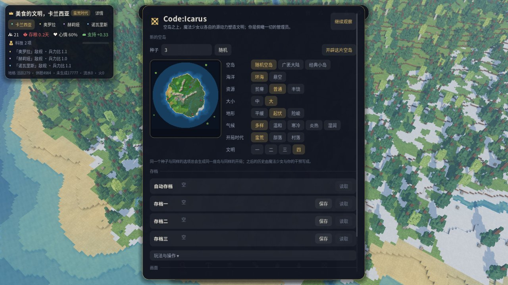
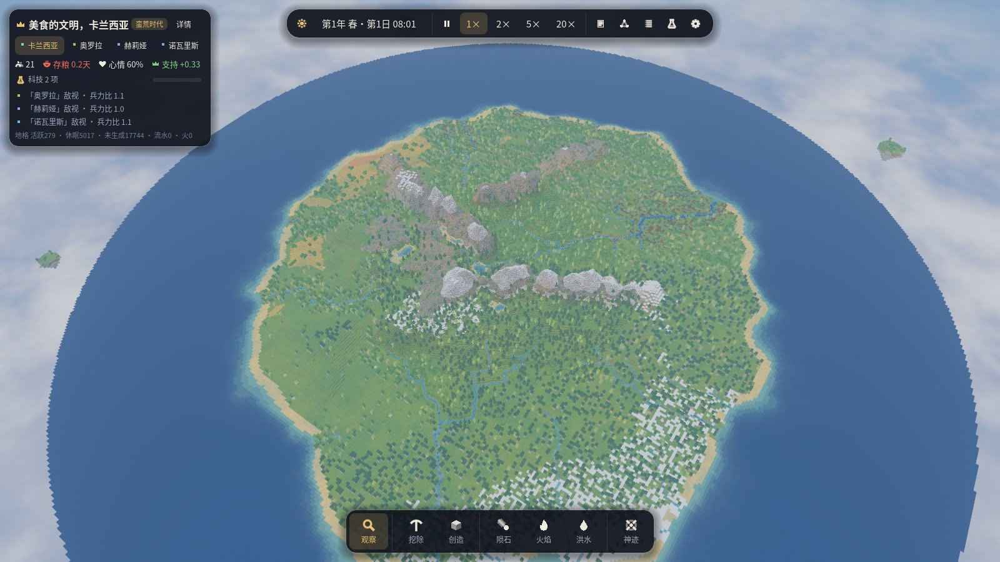
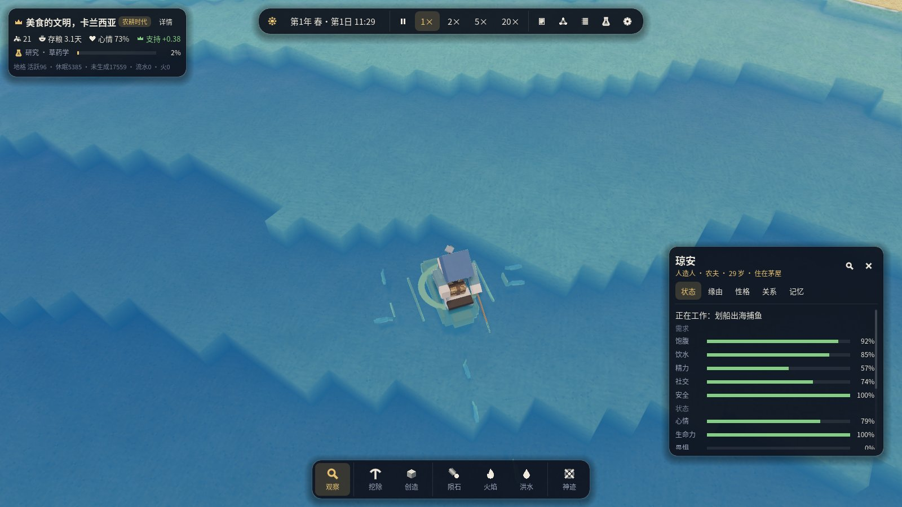
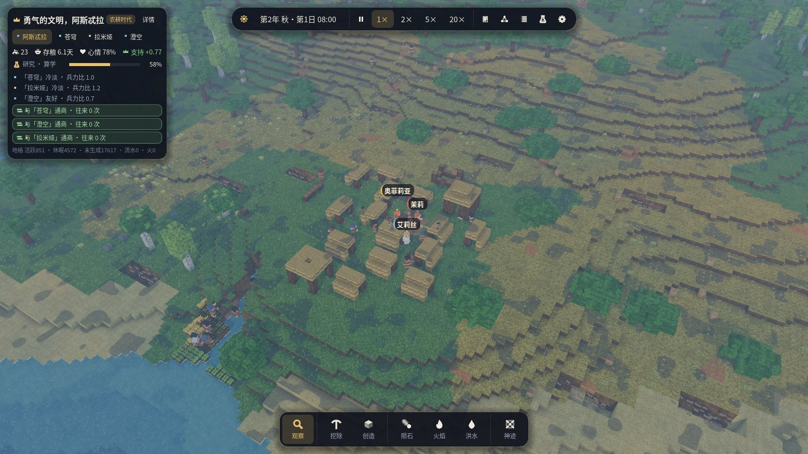

# 第三版本开发计划：河与海、随机空岛、整体智能

本版本做三件事：

1. **河与海**：更大的空岛，河流从山地流向四周的海；海洋外缘有「空气墙」维持海平面；
   海中鱼群在不足时由外海补充；农耕时代的新科技「木船」。
2. **按种子随机的空岛**：地形、群系、水系、自然资源都由种子随机生成；新游戏时可以选择
   「周围是否有海」「资源丰富度」「岛屿大小」「地形」「气候」「文明数」等。
3. **整体性地提升角色的智能**：不针对某一张地图调参，而是给文明加上「看得见未来」的规划层，
   让劳动分工、人口、储备、建设、科研与统治者的决策都建立在预测之上。

## 诊断：为什么时间一长各文明都会滑坡

对第二版本做了 64 天（两年）的长时间运行（三国 · 村落开局，种子 1、2）和 48 天的蛮荒三国运行
（种子 3、4、5，与玩家截图的开局相同），并用逐日普查探针统计每个文明的人口结构、存粮、
田地状态、床位、工地、未领取的工作和每小时在做什么。发现的问题不是某一个数值，而是缺少
「计划」这一层：

| 现象 | 根源 |
|---|---|
| 蛮荒三国在第 20–30 天人口涨到 30–37，存粮 0–1 天，粮食短缺（与截图一致） | 采集部落的生育只看「此刻大家都吃饱了没有」，不看周围野果、猎物能养活多少人；孩子要近 19 天才成年，出生高峰在几天后变成饥荒 |
| 掌握农耕 20 天仍没有一块田（种子 4 的阿卡迪亚），停在蛮荒/农耕之交 | 开垦第一片田要先攒 6 份野麦种子，而饥饿的人把采来的野麦当饭吃掉了：越饿越种不了地，越种不了地越饿 |
| 村落三国两年后人口从 21 降到 5–9，仓库里却堆着 300–630 份粮食（够吃 30–130 天） | 劳动力按「此刻哪项工作分数最高」贪心分配：粮食工作永远最紧迫，存粮远超需要仍有一半人种地，房子、仓库、科研没人干；人口老去而新生儿不足（生育不随富足而增加），加上 46 次在三国之间来回投奔 |
| 饥荒时寻路失败、找不到食物的次数暴涨（一局 3000+ 次），单 tick 开销翻三倍 | 找不到吃的人反复发起同一个失败的搜索；饥荒时的采集点散到 90 格外 |
| 统治者在危机中「维持现状」 | 决策选项只按性格与价值观打分，没有「照这样下去 N 天后会怎样」的预测，也没有内政官给出有依据的建议 |

## 验收场景

### 场景三 · 四国随机空岛（`--layout random --civs 4`）

- 按种子随机生成的大空岛（默认有海、资源普通、地形起伏），四个文明各据一方，蛮荒或部落开局。
- 环境不能「过于简单」：资源丰富度为「普通」，有狼熊、有战争、有旱季式的缺水与虫灾式的
  减产（随机事件）、河流需要找渡口、海水不能喝也不能灌溉。
- **岛的「总体文明情况」**：每天记录每个文明与全岛的文明指数（人口、温饱、储备、住房、建筑、
  科技与时代、知识、民心与秩序的加权组合，见下文），并在界面中显示曲线。
- 验收：多种子批量运行（每局 ≥ 64 天），以全岛文明指数后半程的线性趋势与首末比较为准，
  上升态势的比例要高（目标 ≥ 80%），同时统计饿死、渴死、人口、科技时代、战争等。

### 兼容

第一、二版本的经典小岛与广袤大陆布局、三国与蛮荒场景继续可用，旧存档继续可读；
智能的改造同样作用于旧布局（回归实验：二版的验收脚本仍要通过）。

## 里程碑

每个里程碑拆成可独立验证的小步：实现 → 无头测试 → 真实渲染检查 → 提交推送。

### M19 · 随机空岛：地形、群系、水系、资源
- 新布局 `WorldLayout::Random`（「随机空岛」）；`WorldConfig` 增加 `sea`、`richness`、`size`、
  `relief`（地形起伏）、`climate`；所有取值写入存档，老存档读作默认值。
- 生成步骤（全部是种子的纯函数，初始化时在粗网格上预计算，之后每一列 O(1) 查询）：
  1. 岛形：扭曲的径向衰减 + 噪声，海岸有海湾、半岛与小岛；
  2. 高程：大陆底座 + 随机走向的山脉（脊状噪声）+ 丘陵 + 台地；「地形」选项缩放起伏；
  3. 水文：在粗网格上做优先队列泛洪（priority flood）填洼，洼地成湖；D8 流向与汇流累积，
     累积超过阈值的地方成河，河宽随流量增长；河道一路流向海（无海时汇入岛边的湖）；
  4. 河流是**静水的阶梯**：每一段水面平直，段与段之间是与上游水面齐平的石堰（兼作渡口），
     物理上完全静止、零开销；所有水面由「水不外漏」的局部规则保证：旱地列不低于相邻水面，
     低水面列若紧挨高水面列则成为堰；
  5. 河谷：河两岸的地形按距河的远近下切，形成自然的河谷与河漫滩；
  6. 群系：温度（气候选项 + 纬度式噪声 − 海拔递减）与湿度（噪声 + 离水远近）决定，
     复用二版的群系、地表材料、树木与野外资源；
  7. 资源：矿脉（铜、锡、铁）、燧石、黏土（河边）、浮空石核心、野生谷物、果树、草药、
     动物与鱼群的密度随「资源丰富度」缩放；
  8. 文明选址：在淡水边、平坦、肥沃、互相远离、所处群系尽量不同的地方挑选 1–4 个，
     以资源评分做公平性约束，然后整平为台地。
- CLI：`icarus_cli map --layout random --sea 1 --richness 1 ...` 输出俯视图，批量检查
  多个种子的地形与选址。

### M20 · 海：空气墙、海平面与海鱼
- 海是环绕岛屿的圆盘形浅海，坐落在浮空岩盘上；海盘外缘是看不见的空气墙：水不能越过；
  海里的水是**无限的水库**：海平面以下的海水流走会被补满，高出海平面的水会消失，所以
  海平面永远不变（在海底挖洞，海水会一直漏下去，但海面不降）。
- 海水是咸的：不能喝、不能灌溉；居民找水、灌溉判断都区分淡水与海水。
- 海鱼（鲭鱼、鲷鱼、外海的金枪鱼）组成渔场；近岸渔场可在岸边叉鱼，外海渔场要坐船；
  海中渔场的鱼少于承载量的一半时，从外海游来补充（确定性的补充速率）。
- 画面：海面的深浅着色、岸边浪花、外缘空气墙处的水幕与岩盘断面。

### M21 · 木船
- 农耕时代科技「木船」（前置：木工）：可建「船坞」；船坞用原木造船（船是物品，放在船坞）。
- 驾船捕鱼：渔民从船坞取船，沿水面航行到外海或大湖的渔场（直线 + 水面网格寻路），
  捕获更多的鱼，返回船坞卸货还船；航行途中不需要落脚点。
- 存档：角色的「在船上」状态、船的位置；画面：船的体素模型与划桨动作。

### M22 · 新游戏选项界面
- 世界菜单：布局增加「随机空岛」（默认）；选中后显示「海洋」「资源」「大小」「地形」「气候」
  「文明数（1–4）」「开局时代」；每个选项有说明。
- 岛屿预览：改动种子或选项后，立即生成一张俯视小地图（只取样列信息，不生成方块），
  标出文明的出生地。
- 界面风格沿用现有主题（浮动卡片、自定义芯片按钮、Noto Sans SC）。

### M23 · 整体智能：文明的规划层
每个文明每隔几个游戏小时（以及重大事件后）做一次「内政规划」，结果保存在存档里，
并在界面与议事录中可见（「内政官的报告」）。

1. **评估**：人口结构（劳力、儿童、老人）、每日口粮、各种粮食来源的可持续产量
   （田地的预计收成、周边可采的野果与野麦、猎物、渔场的可持续捕捞量）、储存与腐坏、
   床位、建材存量与在建工程的需要、可用工时。
2. **预测**：按当前劳力分配推演未来若干天的存粮曲线，给出「承载人口」（可持续的粮食产量
   能养活多少人）与瓶颈（土地、灌溉、劳力、工具、住房、储存）。
3. **目标**：储备天数（蛮荒 3 天、农耕后 8–12 天）、种子储备（下一轮播种所需，不被吃掉，
   除非真正的饥荒）、住房目标、建材目标。
4. **分工**：按目标给各类工作定配额（粮食、建设、采集建材、手工、科研、搬运、军事），
   按技能与性格把居民分到职业；居民选工作时，本职与缺人的类别得到加成、超额的类别受压制；
   存粮远超目标时，粮食劳力自动转去建设与科研；低于目标时反之。取代现在的「贪心 + 补丁」。
5. **人口**：生育取决于「预测的承载人口 − 现有人口」与抚养比，而不是某一刻吃没吃饱；
   富足而人少时生育更多，逼近承载上限时自觉节育；首代居民不会整体老去而无人接替。
6. **饥荒预案**：配给、全员转向粮食、保留种子、宰杀、向盟友求援、分出一部分人去开拓新村。
7. **扩张与基础设施**：田不够就开新田，灌溉不够就挖渠或迁往水边，缺床就建房，
   腐坏多就建仓库/陶器；这些作为「内政官的建议」进入统治者的决策（偏置随紧迫度增长），
   统治者的性格决定风格与取舍，但不会对迫在眉睫的危机视而不见。
8. **科研方向**：优先解决当前瓶颈的科技（采集到顶就研究农耕，灌溉不足研究水利，
   腐坏多研究制陶/储藏），同样作为建议交给统治者。
9. **居民个体**：出远门前先吃喝、带干粮；本职工作的连续性；不可达目标的记忆；
   找不到食物时不再反复发起失败的搜索；搬运成批进行。

### M24 · 文明指数与第三版本验收
- 文明指数（每个文明与全岛）：
  `人口 × 温饱 × (1 + 储备) + 住房 + 建筑 + 科技与时代 + 知识 + 民心与秩序`（具体权重见实现），
  逐日记录在历史里，界面上以小曲线显示。
- 场景三批量实验（≥ 8 个种子 × ≥ 64 天），二版验收回归；性能测量；截图；文档更新。

## 实施顺序

M19 → M20 → M23 → M21 → M22 → M24。智能改造（M23）在二版的大陆布局和新的随机空岛上同时验证，
每一步都用长时间运行对比改造前后。

## 完成情况

- **M19 随机空岛** ✅ `worldgen_random.cpp`：粗网格上的高程、温湿度与排水；洼地成湖，河流是一级一级的
  静水河段（石堰相隔，岸不低于水面），开局即静止；四个文明的选址平坦、近淡水、彼此远离、气候不同，
  有海时其中一个靠近海岸。每列的计算按地格列缓存一圈邻列，开局时间从 3.0 秒降到约 2.7 秒。
- **M20 海** ✅ 环岛的圆形浅海坐落在空气墙之内，海平面恒定（海底挖洞海水照样流下去、海面不降；
  倒在海上的水会流走）；海水是咸的，不能喝也不能灌溉；鲭鱼、鲷鱼、金枪鱼分布在近岸与外海的渔场，
  少了会从外海游来补充。远景的薄雾随镜头拉远而变淡，整座岛都看得清。
- **M21 木船** ✅ 农耕时代科技「木船」（前置：木工、捕鱼），工坊造船；渔民扛船到离鱼群最近的岸边，
  沿水面航路（绕开岬角）划到外海撒网，再划回来；测试覆盖从下水到收获与船的账目。
- **M22 新游戏选项** ✅ 世界菜单：随机空岛（默认）、海洋、资源、大小、地形、气候、开局时代、文明数，
  右侧即时预览（后台线程生成，标出出生地与浮岛）。
- **M23 整体智能** ✅ 内政官的规划（粮食账本、可持续产量、储备目标、按职业分配人手、生育、建议）
  以及验收中发现的一系列问题的修复（见下）。
- **M24 文明指数与验收** ✅ 每个文明与全岛逐日记录文明指数；`icarus_cli trend` 与
  `tools/v3_acceptance.sh` 可重复地批量验收（结果见下文，后半程的严格标准未稳定达到 80%）。

### 验收中发现并修复的问题

长时间运行（四国 · 蛮荒开局 · 随机空岛，32–64 天，多个种子）逐一暴露的问题，每一个都先用探针
复现、定位根因，再做通用的修正，而不是针对某张地图调参：

| 现象 | 根因 | 修正 |
|---|---|---|
| 第 20 天后单 tick 18 ms，劫掠军「在村外集结」却永远走不到 | 670 格外的目标用一次 6 万节点的搜索找路，失败后每 10 tick 重试 | 远路分段：8×8 格的粗网格路线 + 每段 48 格的短搜索（`agents_route.cpp`）；同一局面降到 1.2 ms |
| 远离家乡的人反复找不到水，每 tick 数万次寻路 | 附近的水都够不着 → 「被困」逻辑清空黑名单 → 又去找同样的水 | 远离家乡时先找近处的溪流，都不行就走回家乡的泉边；「被困」检查只看第一段路 |
| 一个村子一天之内二十人渴死 | 两个迎面而来的人在格子中心互相「靠右让路」，绕着同一点转圈二十小时 | 走到格子中心的最后一段不再让路 |
| 掌握农耕却从不种地（北方针叶林的部落） | 周边不长野麦，没有谷种 | 全岛搜索最近的野麦产地，派人远行采种 |
| 37 块田颗粒无收 | 田被开在湖底、河床上（地面上方是水） | 开田与扩田都要求地面上方是空气 |
| 首代居民两年内几乎全部老死，人口减半 | 生命被压缩（每天 0.75 岁），规划只看此刻能不能多养人，不为世代更替留孩子 | 内政官预见一代之后将老去的人，按需放开生育；未婚的成年人在村里相识、按年龄相近结为伴侣 |
| 劫掠与反劫掠拖垮几个文明 | 统治者只按源动力取舍，伤员被当作敌人继续追杀 | 内政官权衡战争的代价（反对开战、及早议和、撤军）；重伤者无论在做什么都退出战斗、伤愈前不再征召；不缺粮时「劫掠」不再可行（复仇除外）；自己存粮有余而邻国断粮时，内政官建议送粮 |
| 田边的河水一天天变浅，一百多块田颗粒无收 | 采石坑开在河岸的沙地上，河段的水从坑里流走 | 采石坑远离一切水面，采矿不挖挡水的方块；随机空岛的河湖若低于原水位，会从上游慢慢补回 |
| 人口涌入一个文明，远超它能养活的数量 | 投奔只看对方「此刻吃得饱」 | 对方土地已养不起更多人时，投奔的意愿大减 |
| 饥荒时不肯扩田 | 「谷种留作口粮」一律生效 | 只有谷种够全民吃上一天时才留着吃 |
| 疏通泉眼要三天 | 挖一块石头就走回仓库 | 挖掘者把土石堆在旁边继续挖；缺水时挖掘算作最优先的建设 |
| 首夜只有三分之二的人睡在家里 | 疲倦就在野外倒头便睡 | 只有精疲力竭才露宿；收工后远处的人先回家（危机时除外） |
| 全岛文明指数在一国并入另一国时下跌 | 各国的「知识」被重复累加 | 全岛的知识只按全岛已知的科技计一次 |
| 统治者连续二十天每天下令「扩建田地」，田却一块没多，房子也没人盖 | 田边已没有水渠能浇到的空地，命令落空却毫无记录，下次照样得分最高 | 田地先报告还能扩多少块（`Farming::expansion`），没有空地就改为去别处水边开新田；找不到建址、开不出田的命令被记住，两天内不再重复 |
| 五十多人只有八张床，四十天没有变化 | 每次施政只盖一座两人的窝棚 | 缺床多时一次按建造人手规划几座；同一次决定的几处工地只算一项工程 |
| 学会文字后二十天建不起书写室，农耕研究停在四分之一 | 开局饥荒时下达的「全力务农」（建设优先级 0.5）永不撤销，建造者都去采集，窝棚工地停工，占满了同时开工的名额 | 应急措施两天到期、饥荒缓解即撤回（记入编年史）；内政官力荐的建筑可以在两处未完工程之外开工 |
| 统治者每两天在「按劳分配」与「平均分配」、「加重」与「减轻惩罚」之间来回翻转 | 每个改变都只看新政策的好处，不看放弃的旧政策 | 政策改变按与现状的差值权衡；刚改过的政策短期内不再改回 |
| 夜里公共仓库见底，挨饿的人找不到吃的 | 收工的人带着一天的收获睡觉，四十份口粮在口袋里过夜 | 仓库顺路时，睡前先把随身的粮食入库 |
| 一国刚停战又对另一国开战，一局十余场战争 | 战争结束不留痕迹 | 「厌战」：每场战争按天数与伤亡累积，逐日消退；厌战时开战的意愿降低、更易接受议和，内政官劝其休养生息 |
| 大村子白天七分之一的人站着不动 | 披着皮斗篷、拿着工具就算「身上有货」：闲下来就去仓库「归还」，什么也没放下，下一刻又去，每两个 tick 循环一次；农夫每收一块田都要回一趟仓库 | 只有装备以外的东西才算要归还的货物（降到两百分之一） |
| 孤独的人整个上午都在找人聊天 | 附近没人有空时聊天立即失败，下一刻又去找 | 找不到人聊天后，一小时内不再急着找 |
| 劫掠归来掉队的人在野外一个接一个渴死 | 远离家乡时只找最近的水塘，不管那里刚刚走不到：每个 tick 都选中同一处够不着的水，原地不动 | 找野外水源时跳过自己走不到的地方 |
| 田已过百块，四十人仍挤在十二张床里 | 看重发展的统治者每次施政都选「扩建田地」 | 新田的价值按缺多少田计算：田不够时十足，超过内政官估算的需要后只剩四分之一 |
| 有存粮的战时国家一天饿死九人 | 「按劳分配」下，工作时间没在干活就记为怠工——连玩耍的孩子、老人、出征的士兵、养伤的人也算——歉收时「怠工」超过三小时就领不到口粮 | 只有能干活的成年人才记怠工、才会被停发口粮 |
| 两军都已回家，战争仍拖了一周，民兵天天站岗不干活 | 胜方坚持要赔粮，败方拒付；平息要等四天毫无动静 | 战事每平静一天，提出与接受「无条件停战」都更容易 |
| 伤重不治成了仅次于老死的死因 | 不懂草药就没人包扎，重伤者一直流血 | 有人伤重不治或伤者增多时，内政官建议研究草药学 |
| 存粮还够三天的国家出兵抢粮 | 「缺粮」按存粮目标的六成算 | 存粮不足一天半、或正在吃老本时，劫掠才算一条出路（复仇除外） |

### 场景三验收结果

`tools/v3_acceptance.sh out/v3 1-16 64`：随机空岛（有海、资源普通、地形起伏）、四个文明蛮荒开局、种子
1–16、每局 64 天（两年，首代居民在这期间几乎全部老去）。最终代码的一批：

| 种子 | 全岛文明指数 起→中→末 | 全程趋势 | 后半程趋势 | 态势 | 人口 起→末（最多） | 出生 | 死亡（年老/饿死/渴死/战死/伤重） | 宣战 | 有战事的天数 |
|---|---|---|---|---|---|---|---|---|---|
| 1 | 50 → 76 → 61 | -0.07/天 | -0.34/天 | 回落 | 68 → 45（92） | 40 | 63（32/8/0/7/15） | 5 | 22 |
| 2 | 50 → 98 → 98 | +0.75/天 | -0.12/天 | 回落 | 68 → 74（92） | 62 | 55（34/8/0/6/7） | 7 | 27 |
| 3 | 53 → 113 → 121 | +1.19/天 | +0.16/天 | 上升 | 68 → 70（95） | 55 | 51（41/2/1/3/2） | 4 | 31 |
| 4 | 52 → 107 → 115 | +0.96/天 | +0.20/天 | 上升 | 68 → 78（98） | 64 | 52（40/0/0/6/3） | 4 | 6 |
| 5 | 51 → 100 → 113 | +0.96/天 | +0.46/天 | 上升 | 68 → 70（90） | 56 | 54（34/1/0/3/16） | 6 | 29 |
| 6 | 52 → 101 → 98 | +0.79/天 | -0.37/天 | 回落 | 68 → 59（97） | 55 | 63（41/4/0/8/10） | 7 | 45 |
| 7 | 51 → 106 → 130 | +1.32/天 | +0.81/天 | 上升 | 68 → 93（101） | 73 | 47（43/0/0/1/2） | 1 | 4 |
| 8 | 51 → 100 → 112 | +0.87/天 | +0.52/天 | 上升 | 68 → 76（91） | 62 | 53（34/0/0/14/4） | 5 | 11 |
| 9 | 51 → 95 → 86 | +0.41/天 | -0.28/天 | 回落 | 68 → 51（85） | 49 | 67（35/1/0/19/9） | 9 | 39 |
| 10 | 54 → 102 → 99 | +0.80/天 | -0.21/天 | 回落 | 68 → 70（93） | 57 | 54（34/2/0/7/6） | 8 | 31 |
| 11 | 53 → 137 → 157 | +1.66/天 | +0.56/天 | 上升 | 68 → 104（110） | 79 | 45（43/0/0/0/0） | 0 | 0 |
| 12 | 52 → 107 → 106 | +0.87/天 | -0.06/天 | 回落 | 68 → 71（98） | 59 | 55（44/1/0/7/3） | 4 | 7 |
| 13 | 52 → 107 → 118 | +0.89/天 | +0.12/天 | 上升 | 68 → 75（89） | 65 | 58（38/1/0/8/5） | 5 | 14 |
| 14 | 52 → 119 → 112 | +1.00/天 | -0.05/天 | 回落 | 68 → 73（100） | 59 | 52（41/1/0/2/6） | 7 | 30 |
| 15 | 51 → 118 → 118 | +1.15/天 | +0.05/天 | 上升 | 68 → 81（101） | 68 | 54（42/3/1/3/5） | 4 | 18 |
| 16 | 50 → 88 → 75 | +0.34/天 | -0.69/天 | 回落 | 68 → 44（88） | 41 | 66（33/9/2/8/6） | 11 | 35 |

- **末值高于起点：16/16**；**全程线性趋势上升：15/16**（唯一的例外种子 1 两年间几乎没有一天停战）。
- **后半程趋势也上升（严格标准）：8/16**。这一项在种子间极其敏感：同一套机制上做很小的改动，
  整批结果就会重新洗牌——最后四批（每批 16 局，彼此只差一两处小修正）分别是 12、12、10、8 局，
  合计 42/64 ≈ 66%。**严格标准下 80% 的目标没有稳定达到**。
- 后半程回落的局有两个共同点：一是首代居民在第 20–64 天集中老去，而新生儿在指数里只算半个人、
  要近 19 天才成年；二是战争——回落的局平均有战事约 30 天，上升的局约 14 天；战死与伤重不治合计
  每局约 13 人，是老死之外最主要的死因。统治者的源动力堕落为愤怒、暴食、嫉妒后更好战，这正是
  「性格与源动力塑造文明」的一部分，没有为了指标去削弱。
- 验收过程早期的批次平均每局饿死 5–10 人（最多近 30 人），最终降到平均 2.6 人，渴死 0.2 人；
  不再有「粮仓见底、无力盖房、发展停滞」一路滑到底的局面（最差的一局末值也比起点高 22%）。
- 性能：四局同时运行时每个游戏日 6–10 秒（单 tick 平均约 1–1.7 ms）。
- 第二版本的场景（大陆三国 3 局、大陆蛮荒 2 局，各 32 天）作回归：5 局都没有人饿死或渴死，各国存粮 0.6–21 天，温饱 86–100%，整局最多一场战争。

