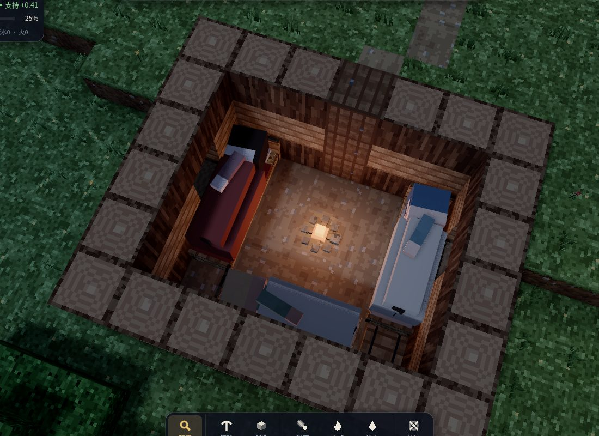
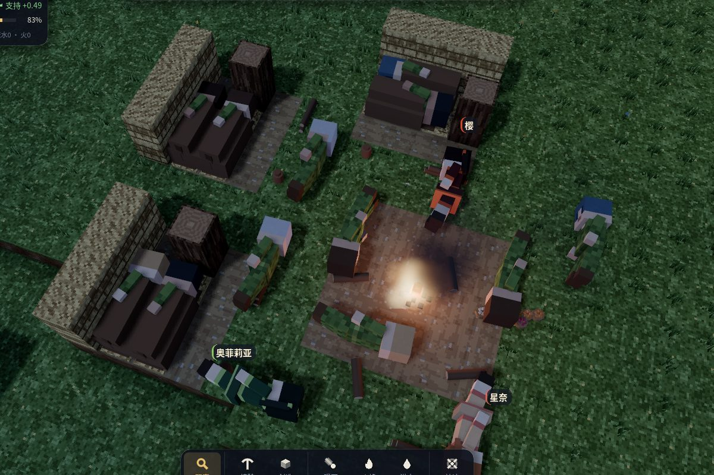
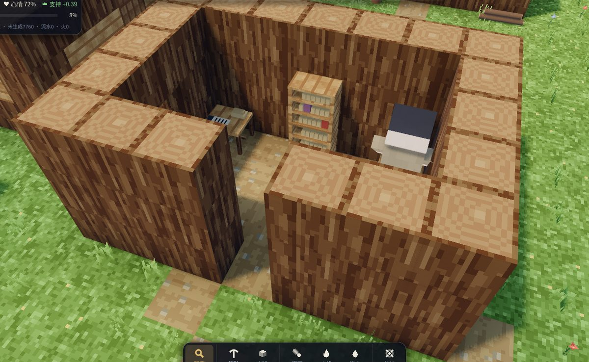
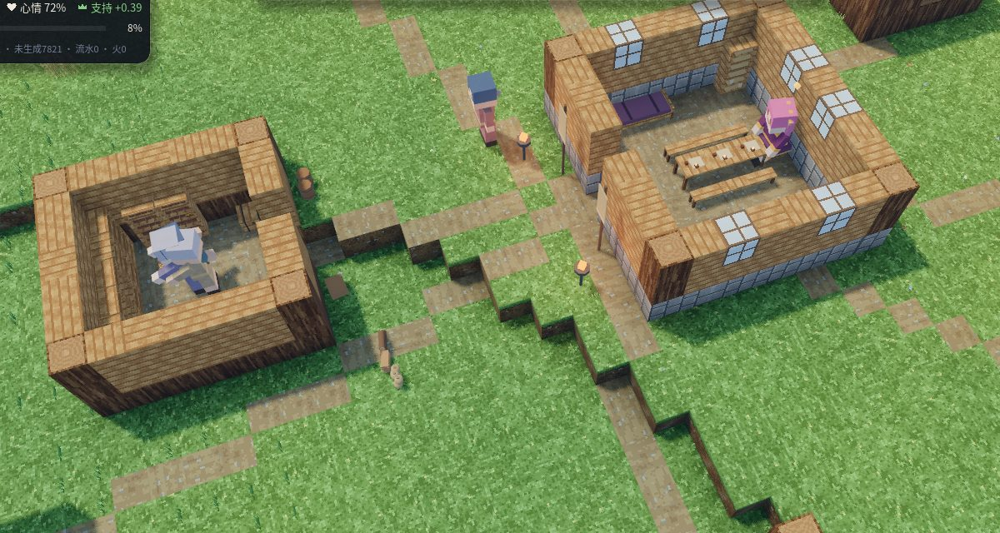
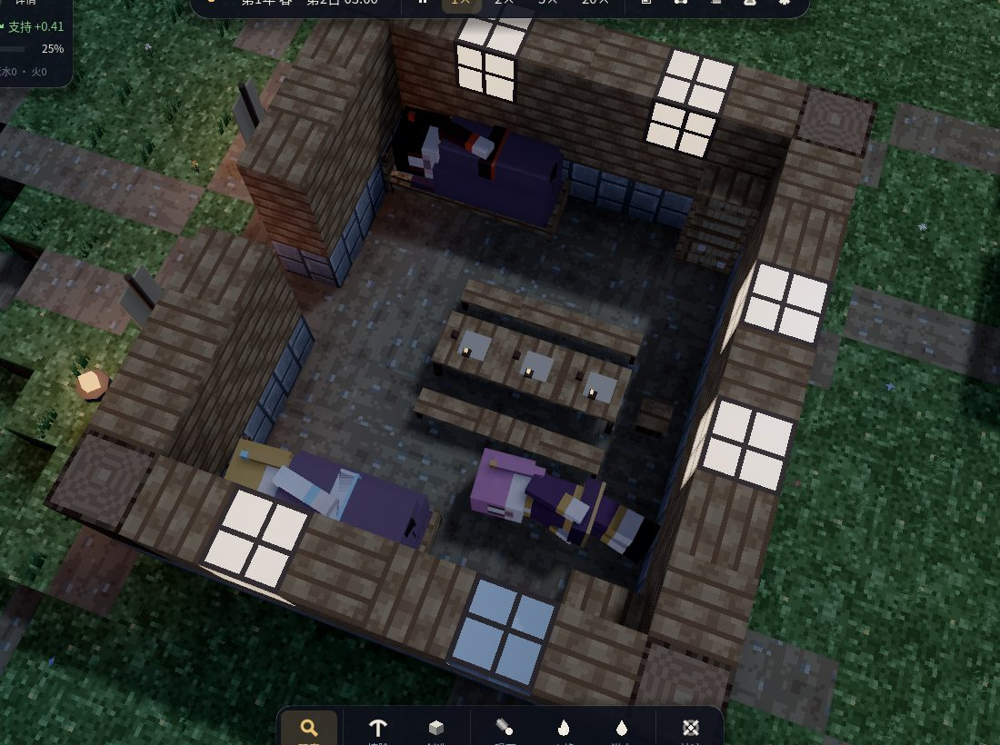

# 第四版本开发计划：建筑与建筑的使用

目标：从建筑设计本身开始，让每一座建筑「看起来像能住、能用」，居民也「像真的在用」——
进门、躺在床上、坐在书案前、站在工作台边，而不是躺在窝棚旁的草地上、堵在书写室门口。

## 诊断：现在的建筑为什么用起来很怪

| 现象（截图） | 根源 |
|---|---|
| 窝棚的主人都躺在窝棚旁边的空地上 | 行走需要 3 格净空，窝棚顶只有 2 格高，没有一个能站进去的格子；「床」找不到位置，就铺到了外面 |
| 书写室的学者站在门口「钻研新知」 | 每座建筑只有一个「内部位置」（门后第一格），研究、制作、烹饪、存取全都挤在那一格 |
| 茅屋的主人有时躺在屋外墙根 | 屋里没有床，只在地面上临时找 3 格长的空地；放不下就睡到外面，而离门 3 格以内都算「在家」 |
| 屋子里空无一物 | 建筑只有墙、顶和门；室内陈设（床、书案、工作台、灶台、货架）根本不存在 |

## 设计

### 家具是真实的方块
新的材料：木床、草席、书案、木凳、工作台、灶台、货架、药架、议事长桌等。它们出现在建筑蓝图里，
由建造者一块块搭起来，花费真实的材料，也会被火烧毁、被陨石砸坏。每种家具有自己的模型
（床架与铺盖、桌面与卷轴、灶口的火光……），而不是一个实心方块；家具也有通行属性：
草席可以踩过，床、桌、灶台挡路。

### 蓝图中的「使用位」
蓝图里的家具自动生成使用位：
- **床位**：一张床（沿一条线的 3 格床或草席）＝ 一个床位：躺的位置、朝向、从哪一格上床。
  建筑的床位数由蓝图里的床决定，不再是一个手填的数字。
- **座位**：书案前的木凳 ＝ 学者的座位（坐的位置、面朝书案）；议事厅长桌边的座位。
- **工位**：工作台、灶台、药架前的那一格 ＝ 工匠、厨子、药师站着干活的位置（面朝台子）。
- **存取位**：货架前的那一格 ＝ 搬运工放下、取走物资的位置。
- 门、门前一格、室内过道保持畅通；使用位都不在门口。

### 重新设计每一座建筑
窝棚（净空足够的斜顶棚、两张草席）、茅屋（三张床、门、窗、火塘）、长屋（六张床）、书写室
（两张书案、书架）、学舍、书院、工坊（工作台、工具架）、灶房（灶台、案板）、药庐（药架、病床）、
仓库与粮仓（货架、陶罐）、议事厅（长桌与座位）。尺寸按居民的身形（约 2.6 格高、3 格长）来定。

### 居民真正使用建筑
- 每个住户有自己的床；夜里从门进屋，走到床边，躺到床上；醒来下床从门出去。床不够时才打地铺，
  屋里也没地方才露宿——「在家」只看是否真的在屋里。
- 学者走进书写室，坐到空着的木凳上，面朝书案；工匠站在工作台前；厨子守着灶台；
  病人躺在药庐的病床上接受包扎；统治者坐在议事长桌的上首。
- 谁也不再堵门口；座位、床位按人分配，不会两个人挤一个位置。

### 表现
- 躺在床上（床面高度）、坐在凳上、对着台子干活的姿态；朝向由使用位决定。
- 室内看得见：选中或镜头贴近一座建筑时屋顶掀开（剖切视图），能看到里面的人和陈设；
  夜里有人的屋子窗口透出灯光。

## 里程碑

- **M25 家具方块**：材料、通行规则、网格模型、贴图、材料与造价。
- **M26 蓝图与使用位**：图例扩展；从蓝图推导床位/座位/工位/存取位；全部建筑重新设计；
  存档兼容（旧存档里的旧建筑照常可用）。
- **M27 居民使用建筑**：床位分配与上床下床、学者入座、工位、存取位、病床、议事座位；
  「在家」与拥挤的判断。
- **M28 姿态与剖切视图**：躺、坐、工作姿态；屋顶剖切；窗光。
- **M29 验收**：内核测试（每种建筑的使用位可达、互不重叠、不堵门；住户都睡在自己的床上；
  学者坐在书案前）；真实渲染截图；第三版本的长时间验收回归（经济与人口不能因此退步）。

## 实现结果

### 家具与建筑（M25、M26）
- 13 种家具材料：木床、草席、书案、木凳、书架、工作台、灶台、货架、药架、长桌、长凳、木箱、火塘。
  每种都有自己的网格模型（床架、草褥、枕头、按床着色的被子；书案上的竹简、摊开的卷轴、砚台和笔；
  书架上的卷轴；灶口的火光和锅；货架上的陶罐、麻袋和筐……），用真实材料建造（木、草秆、石），
  会被烧毁、砸坏。床、书案、台子挡路；草席、木凳、长凳可以踩过；家具顶上不能站人。
- 蓝图图例用小写字母表示家具；使用位由内核从蓝图推导（`derive_slots`，放置与读档时重算，不存档）：
  床位（连成一线的床或草席，床头靠墙；网格和内核用同一段 `furniture_run` 判断床的走向和床头）、
  座位（书案、长桌旁的木凳与长凳）、工位（工作台、灶台、药架前的地面）、存取位（货架、木箱前的地面）。
  门口与门内一格永远不是使用位。房子的床位数就是蓝图里的床数；仓库的存取点在最靠中间的货架前。
- 重新设计的建筑（人约 2.6 格高：走动的地面上方都有 3 格净空，门 3 格高）：

| 建筑 | 尺寸 | 陈设 | 造价（旧→新） |
|---|---|---|---|
| 窝棚 | 4×4（含棚前空地） | 两张草席；棚高 2 格，人弯腰从棚前钻进去躺下 | 20 → 18 |
| 茅屋 | 7×6 | 三张木床围着火塘、木箱、侧墙小窗 | 99 → 101 |
| 长屋 | 11×7 | 六张木床、火塘、两只木箱 | 150 → 167 |
| 书写室 / 学舍 / 书院 | 7×5 / 9×5 / 9×6 | 2 / 3 / 4 张书案配木凳，书架（书院双层） | 79 / 127 / 193 → 81 / 101 / 159 |
| 议事厅 | 9×8 | 长桌两侧长凳、上首木凳、书架、两张给魔法少女的床 | 281 → 234 |
| 工坊 / 灶房 / 药庐 | 7×5 / 5×5 / 7×5 | 工作台与工具架 / 灶台与陶罐架 / 药架、病床 | 112 / 37 / 68 → 107 / 33 / 84 |
| 仓库 / 粮仓 | 7×7 / 7×6 | 两层货架、木箱 / 陶罐架 | 167 / 95 → 175 / 105 |

（造价按材料份数计；一捆草秆能苫两格茅草屋顶，见下文。）

- 旧存档里按旧蓝图盖起来的建筑没有家具、没有使用位，照旧可用（原来的地铺与「门内一格」）。

### 居民使用建筑（M27）
- 每个住户有自己的床（按家中排行）：夜里走到床边、翻身上床、盖好被子躺下，头枕在床头；醒来或被叫走时
  从上床的那一侧下来。床不够时才在屋里打地铺（不占别人上床、干活的位置，也不在门口），屋里也没地方才露宿。
  「在家」只算在墙内、屋顶下。魔法少女睡在议事厅里的床上（议事厅不分给普通居民）。
- 学者走进书写室，坐到空着的木凳上面朝书案；厨子站到灶台前；工匠从仓库取了料，搬到空着的工作台前做，
  做好的东西留在工坊的库里；伤者躺上药庐的病床包扎；统治者坐在议事长桌的上首。谁在用哪个位置由各人正要
  去的目标决定，不会两人挤一个位置。
- 走到目标时若已经有人站在那一格，会让到旁边空着的一格（此前在仓库里最多七个人叠在同一格）。

### 表现（M28）
- 躺姿抬到床面（草席）高度、盖着那张床自己的被子；坐姿落到凳面，伏案书写；家具里的人不再加随机偏移。
- 剖切视图：镜头拉近（距离 < 58）时，附近建筑的屋顶（和墙的最上一层）从网格里去掉，被选中的人所在的
  房子也一样；窝棚从 2 格高处切开。只影响网格，不改变世界。
- 屋里的火塘、灶台发光并点亮一盏暖色灯，夜里从门窗透出来。

### 回归中发现并修正的问题
- **草秆没有专门的采集**：草秆原来只是为木头砍树时顺带得到的。新屋顶要的茅草更多，仓库里有木头时就没人砍树，
  工地只能干等——有一局的一个文明在蛮荒时代停了两个月，书写室一直差 37 份草秆。现在工地缺草秆时，会派人
  割芦苇、砍树取枝叶（算作采集活，不算找吃的）。
- **困在湖边洼地里的人每个 tick 都重想一遍**：脱困和找水每次都立刻失败，于是下一 tick 又选同样的事，
  整夜的模拟慢了十倍。现在「困住的人」一件事刚开始就失败时，先歇 20 tick 再想；站在淡水边的人就地喝水。
- 房子最初的设计太贵（茅屋 164、长屋 276、窝棚 47），早期发展明显变慢，饿死的人也多了一倍：墙改为 3 格高、
  屋顶只留一道屋脊，窝棚改回低矮的斜棚、人钻进去躺下；并且材料可以一份盖多格（`per_unit`）——一捆草秆苫两格
  茅草屋顶。造价、工地的物料清单、建造者和建造任务都按同一规则计数，按清单备齐的材料恰好用完（有测试）。

### 验收（M29）

**内核测试**（`tests/test_buildings.cpp`，全部 120 个测试通过）：每种建筑的使用位都能从门前走到、互不重叠、
不在门口和门内一格、家具确实在；村子里的住户夜里睡在自家的床上、一人一床、头朝床头、都在屋里，
早上起来没有人留在床里；学者都坐在书案前的木凳上、面朝书案、没有人站在门口；窝棚的两张草席在低矮的
棚顶下、从棚前钻进去、有人睡在上面、醒来都回到能站立的地面；按物料清单备齐的材料恰好用完；
没有家具的旧建筑没有使用位（照旧可用）。Godot 的冒烟、存档、界面测试通过。

**第三版本的长时间验收回归**（`tools/v3_acceptance.sh out/v4_reg 1-16 64`，与第三版本同样的 16 个种子、
随机空岛、四国蛮荒开局、各 64 天）：

| 种子 | 全岛文明指数 起→中→末 | 全程趋势 | 后半程趋势 | 态势 | 人口 起→末（最多） | 出生 | 死亡（年老/饿死/渴死/战死/伤重） | 宣战 | 有战事的天数 |
|---|---|---|---|---|---|---|---|---|---|
| 1 | 51 → 83 → 70 | +0.21/天 | -0.38/天 | 回落 | 68 → 51（89） | 50 | 66（35/10/4/6/8） | 7 | 22 |
| 2 | 50 → 95 → 105 | +0.90/天 | +0.20/天 | 上升 | 68 → 66（87） | 55 | 56（35/8/0/8/5） | 9 | 17 |
| 3 | 52 → 114 → 111 | +0.83/天 | -0.28/天 | 回落 | 68 → 72（92） | 52 | 47（41/2/0/2/2） | 2 | 17 |
| 4 | 51 → 120 → 122 | +1.05/天 | +0.03/天 | 上升 | 68 → 84（100） | 62 | 49（43/0/0/4/1） | 3 | 3 |
| 5 | 50 → 98 → 99 | +0.80/天 | -0.09/天 | 回落 | 68 → 67（91） | 59 | 59（36/3/0/7/8） | 5 | 15 |
| 6 | 52 → 87 → 84 | +0.46/天 | -0.23/天 | 回落 | 68 → 61（91） | 46 | 53（36/5/0/4/6） | 6 | 34 |
| 7 | 51 → 116 → 138 | +1.38/天 | +0.33/天 | 上升 | 68 → 102（111） | 82 | 49（47/0/0/1/1） | 1 | 4 |
| 8 | 52 → 103 → 112 | +0.92/天 | +0.18/天 | 上升 | 68 → 94（103） | 71 | 46（37/0/0/6/3） | 3 | 4 |
| 9 | 51 → 89 → 80 | +0.24/天 | -0.17/天 | 回落 | 68 → 46（91） | 41 | 63（36/8/0/13/5） | 7 | 38 |
| 10 | 54 → 81 → 69 | +0.08/天 | -0.55/天 | 回落 | 68 → 44（87） | 40 | 64（32/5/0/10/14） | 14 | 35 |
| 11 | 53 → 115 → 122 | +0.97/天 | -0.02/天 | 回落 | 68 → 83（99） | 67 | 53（40/0/0/5/8） | 3 | 10 |
| 12 | 52 → 98 → 84 | +0.40/天 | -0.40/天 | 回落 | 68 → 57（98） | 55 | 68（45/0/0/13/7） | 7 | 20 |
| 13 | 53 → 117 → 126 | +1.13/天 | +0.08/天 | 上升 | 68 → 85（96） | 65 | 49（42/0/0/3/2） | 3 | 5 |
| 14 | 52 → 100 → 93 | +0.60/天 | -0.35/天 | 回落 | 68 → 62（93） | 53 | 60（39/4/0/7/10） | 9 | 31 |
| 15 | 50 → 95 → 108 | +0.94/天 | +0.38/天 | 上升 | 68 → 79（91） | 61 | 48（38/2/0/5/1） | 2 | 3 |
| 16 | 51 → 95 → 58 | +0.21/天 | -1.24/天 | 回落 | 68 → 41（102） | 46 | 75（37/13/3/10/9） | 10 | 38 |

- **末值高于起点：16/16**（第三版本 16/16）；**全程线性趋势上升：16/16**（第三版本 15/16）。
- **后半程趋势也上升（严格标准）：6/16**，低于第三版本最后一批的 8/16（第三版本最后四批在 8–12 之间）。
- 与第三版本同种子相比，全岛指数中段平均 100（第三版本 105）、末值平均 99（107）；出生平均 57（59），
  饿死平均 3.8（2.6），战事天数 18（21）。**整体仍在上升，但比第三版本略低**：带家具、3 格净空的房子
  终究比原来的方盒子大，建造和备料要多花人手。
- 这一批之前的几批暴露并修掉了三件事（见上一节）：困住的人每 tick 重想（整夜慢十倍）、草秆没有专门采集、
  房子太贵。房子最贵、草秆没人割时（前 12 个种子）：严格标准 5/12，饿死平均 4.3，一局末值低于起点；
  加上割草、减轻房子之后（16 局）：严格标准 6/16，末值高于起点 15/16，饿死平均 4.9；最后加上
  「一捆草秆苫两格」，就是上表这一批。
- **仍然存在的问题**：少数人口很少的小国（分裂出去的、被战争打散的）或性格懒散节俭的统治者，会让人长期露宿
  （16 局里第 32 天时约有 4 个国家一张床都没有）。这是第三版本的决策模型（统治者的性格压过内政官的建议），
  用旧蓝图做的对照实验里同样出现，本版本没有改动它。
- **第二版本场景回归**（大陆三国 3 局、大陆蛮荒 2 局，各 32 天）：5 局都没有人饿死或渴死，各国存粮
  0.3–15.5 天；三国局各有 1–3 场战争（第三版本记录为每局最多一场）。

